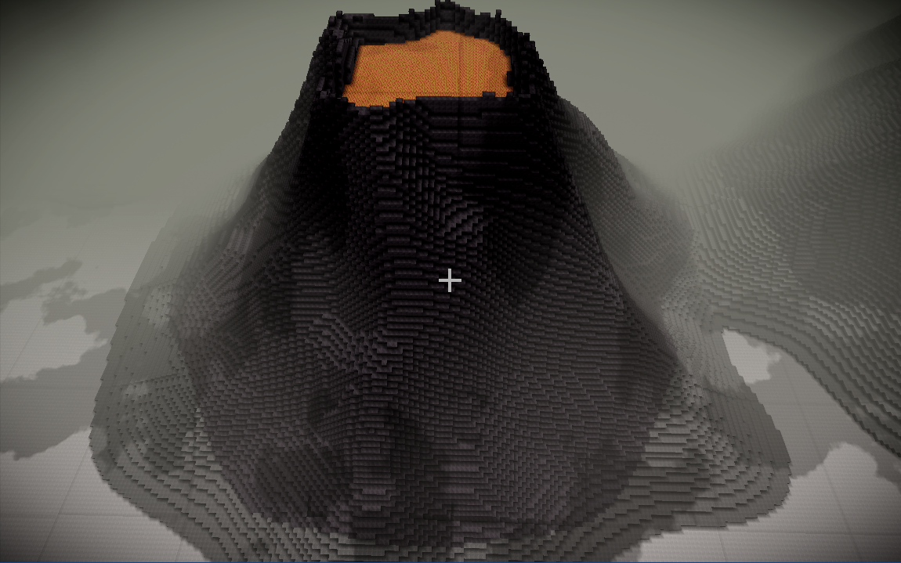

# Volcanoes

Adds noise generated discrete Volcanoes into the world.  
A Provider and Rasterizer is present, you may take help from that Provider to write one that fits your world requirements.

### Steps to quickly test/setup-

 - Check `VolcanoProvider.setSeed` and read the comments there
 - A default flat world generator is provided so use that to quickly build a world
 
 
 
 Future plans:
 - Add Lava creaks flowing out from the top to show highly active Volcanoes. [Example](https://cdn.cdnparenting.com/articles/2020/03/06154936/787922728.jpg)
 - Add Smoke effects
 